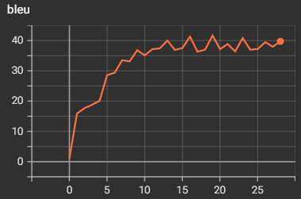
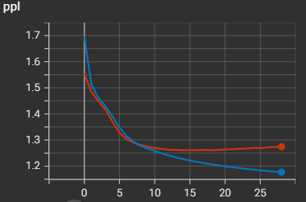
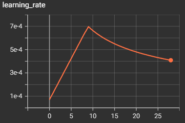

## iwslt2017-en-de
- train: 206112
- validation: 888
- test: 8079

## 实验设置（weight tying 实现应该有问题，不建议用）
- accumulate batch 梯度累积会导致实际 iteration 和原文对不上
- 如果用了梯度累积，epoch 也要翻相应倍。
- 例如：训练集 206112，batch_size = 32，因此一个 epoch 更新 6441 次。如果加上梯度累积，为了模拟大 batch，每 16 个 batch 更新一次参数，则一个 epoch 更新 6441 // 16 = 402 次，要相应延长训练时间
- 但其实后面已经过拟合了，因此不加 epoch 也无所谓
- batchsize = 32，accumulate = 16
- epoch = 35（早过拟合了，选 19 应该更好）
- warmup_step = 4000

### bleu

  

### ppl

  

### lr

  

