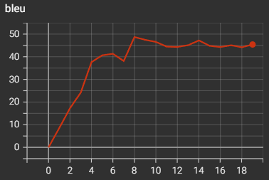
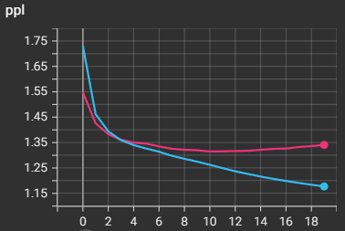
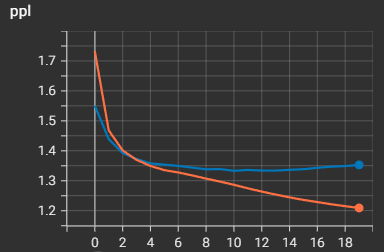
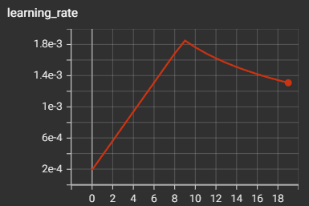
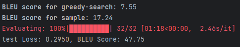

## 实验设置
- 英语德语共享词典
- 原文 embedding 出来没加 ln，泛化性好。加 ln，训练更稳定
- models 和 modules 在模型结构上无差别，但性能有差异，困惑
- batchsize = 32，accumulate = 16
- epoch = 20
- warmup_epoch = 10
- 数据量较少，很快就过拟合了

### bleu

  

### ppl

  

### ppl | embedding 出来没加 ln

  

### lr

  

### 测试性能：embedding 出来没加 ln

  

