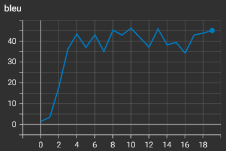
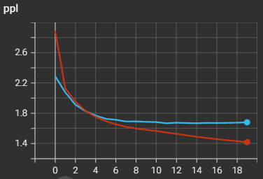
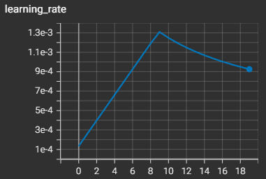
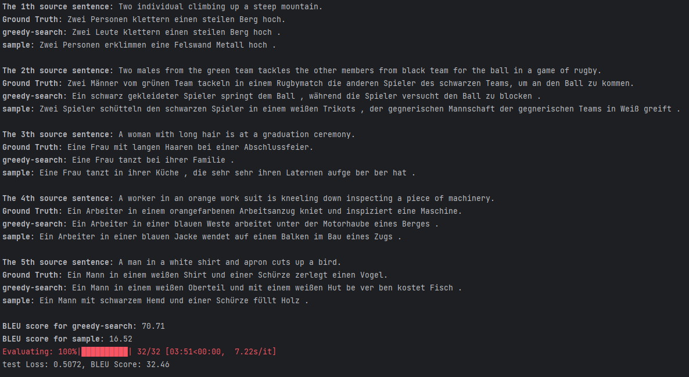

## 实验设置
- 小数据集不能 warmup 太快，通过减小 accumulate_grad_batches 来增加 warmup_step，让学习率增长变缓慢点，否则会梯度爆炸
- 合并了 src_emb 和 tgt_emb，既然英语德语已经共享词典了，直接放在同一个语义空间用向量表示了
- batchsize = 32，accumulate = 8
- epoch = 19
- warmup_epoch = 10
- 再减小 accumulate_grad_batches 会增 ppl

### bleu

  

### ppl

  

### lr

  

### inference
- sample1 的翻译效果很炸裂

  

