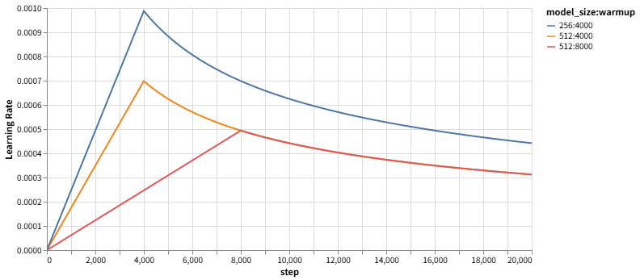

## 实验设置
- 小数据集不能 warmup 太快，通过减小 accumulate_grad_batches 来增加 warmup_step，让学习率增长变缓慢点，否则会梯度爆炸
- 合并了 src_emb 和 tgt_emb，既然英语德语已经共享词典了，直接放在同一个语义空间用向量表示了
- batchsize = 32，accumulate = 8
- epoch = 19（选 18 应该更好）
- warmup_epoch = 10
- 再减小 accumulate_grad_batches 会增 ppl

## 注意
- 如果两种语言不共享词库，去分别定义 src_emb 和 tgt_emb，然后通过赋值来 weight tying，可能会导致有问题，不等价于共享词典 + 共用 emb。

``` python
# 错误示例
self.linear.weight = self.emb.tok_emb.weight
self.src_emb.tok_emb.weight = self.tgt_emb.tok_emb.weight
```
- 这里 src_emb 的权重是被赋予的，而不是自己学的，我猜测这种赋值方式不会让 encoder 学到源语言的语义特征

## scheduler
- d_model 不变的情况下（图中橙红线），学习率峰值由 warmup_step 决定
- warmup_step = warmup_epoch * (907 / (accumulate_grad_batches))
- 增加 warmup_step，峰值减小，学习率增长缓慢，可能学不动。（谨慎减小 accumulate_grad_batches）
- 减小 warmup_step，峰值增加，lr 增长陡峭，可能学很烂。（谨慎减小 warmup_epoch，增大 accumulate_grad_batches）

<div style="text-align: center;">
  
</div>

### bleu
<div style="text-align: center;">
  
</div>

### ppl
<div style="text-align: center;">
  
</div>

### lr
<div style="text-align: center;">
  
</div>

### inference
- sample1 的翻译效果很炸裂
<div style="text-align: center;">
  
</div>
